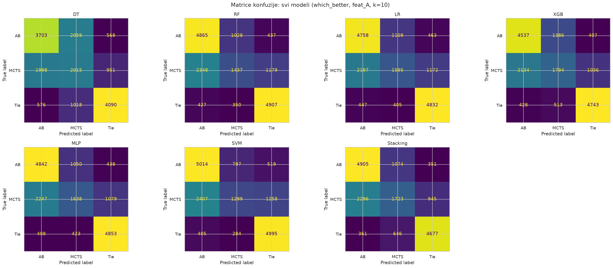
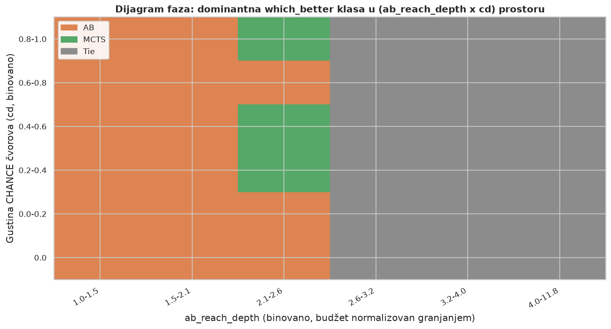
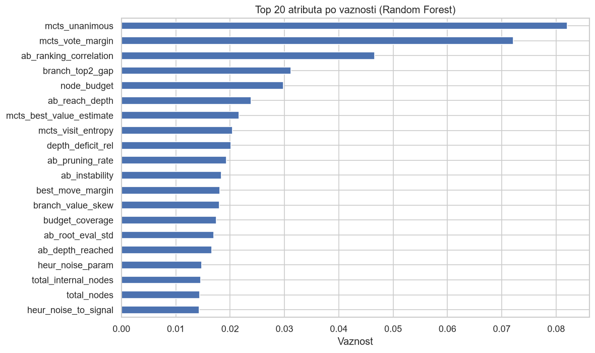

# Game Tree Search Algorithm Selection

Given only the structure of a game tree, predict whether Alpha-Beta or Monte Carlo Tree Search will make the better move under a fixed node budget (a cap on how many nodes each algorithm is allowed to visit), without running either algorithm.

This is framed as an instance of the **algorithm selection problem** (Rice, 1976). The project covers the full pipeline on a self-generated synthetic dataset: generating the trees, exploring the data, preprocessing, selecting features, training and comparing 7 classifiers across 3 attribute sets, interpreting results with SHAP, and testing generalization to tree shapes never seen during training.

Seminar paper for Data Mining 2 (Faculty of Mathematics, University of Belgrade) can be found here: [`docs/izvestaj.tex`](docs/izvestaj.tex) / [`docs/izvestaj.pdf`](docs/izvestaj.pdf).

**Tech focus:**   
Python • pandas • NumPy • scikit-learn • XGBoost • SHAP • matplotlib • seaborn • Jupyter

## At a Glance

- **16,978** synthetic game trees generated (91 attributes each), MAX/MIN/CHANCE/LEAF nodes, ranging from about a hundred nodes to over 50,000
- **7 classifiers** compared (Decision Tree, Random Forest, Logistic Regression, XGBoost, MLP, SVM, Stacking) across **3 different attribute sets**
- Best result: **macro-F1 of 0.692** (Stacking); macro-F1 is a classification score that treats every class equally, so a model can't do well just by favoring the most common one. A random guess would score about 0.33 here
- Structure alone, before either algorithm is run: macro-F1 of 0.554, still far above chance
- Tested on **branching factors** (how many children each node has, on average) **the model never saw during training**, not just a random hold-out
- Interpreted with **SHAP**, a method that scores how much each attribute pushed a prediction one way or the other, to see what structurally makes a tree hard to solve

## Key Findings

1. **Search budget beats raw tree size as a predictor, but the models disagree on how to use it.** The decision tree splits the root directly on `node_budget`, and XGBoost ranks it as its single most important feature. Random Forest instead leans hardest on the *root margin* (`branch_top2_gap`), with the log-derived form of budget (`ab_reach_depth`) only third.
2. **The root margin is an independent, equally strong signal, and it's free to compute.** `branch_top2_gap` (the value gap between the best and second-best root moves) needs no algorithm run at all, yet it's the top Random Forest feature for `which_better` and the single strongest SHAP predictor of whether a tree is hard to solve at all (mean|SHAP| of 0.541, ahead of the other 9 features).
3. **Asking "whose move is better" is a cleaner question than "who found the optimum."** On identical structural features, `which_better` beats `which_algo` (0.554 vs 0.521 macro-F1), generalizes better to unseen branching factors, and has more balanced classes. The reason: `which_algo` mixes up how good the algorithm is with how hard the tree is to begin with, while `which_better` keeps those apart.
4. **Tree structure alone is informative but not sufficient.** The structure-only feature set reaches macro-F1 of 0.554. Adding measurements of the algorithms' actual runtime behavior, such as `mcts_vote_margin`, lifts that to 0.679 (RF) and 0.692 (Stacking). That's a real gain, though the structural signal was already doing most of the work.

## Results

**Macro-F1 by model and attribute set**, 10-fold stratified cross-validation. Set A is the 33 final attributes, Set B is 28 structural-only attributes, Set C is all 81 original attributes.

| Model | Set A (33) | Set B (28) | Set C (81) |
|---|---|---|---|
| Decision Tree | 0.622 | 0.470 | 0.564 |
| Random Forest | 0.679 | 0.554 | 0.649 |
| Logistic Regression | 0.679 | 0.557 | 0.652 |
| XGBoost | 0.689 | 0.556 | 0.664 |
| Neural Network (MLP) | 0.689 | 0.561 | 0.660 |
| SVM | 0.682 | 0.554 | 0.656 |
| **Stacking (DT+RF+XGB, LR on top)** | **0.692** | not run | not run |



**Phase diagram**, showing which algorithm wins depending on how much search depth is available and how much randomness is in the tree:



Alpha-Beta wins across the whole low-budget region no matter how much randomness is in the tree, because MCTS can't build reliable statistics with so few visits per branch. Ties take over the high-budget region, since both algorithms tend to land on the same or a very similar move. MCTS wins in a middle band that shows up most clearly where randomness is high, because averaging over random outcomes hurts AB's shallow heuristic more than it hurts MCTS's sampling.

## What Makes a Tree Hard to Solve

Binary classification of "hard" trees (trees where neither algorithm finds the optimal move), using XGBoost and SHAP on structural features only:

| Rank | Attribute | mean(\|SHAP\|) |
|---|---|---|
| 1 | `branch_top2_gap` (root margin) | 0.541 |
| 2 | `ab_reach_depth` (effective search depth) | 0.446 |
| 3 | `branch_mean_spread` | 0.385 |
| 4 | `branch_value_skew` | 0.312 |
| 5 | `chance_frac_top1` | 0.285 |
| 6 | `chance_node_count_d1` | 0.203 |
| 7 | `node_budget` | 0.175 |
| 8 | `top2_size_ratio` | 0.174 |
| 9 | `budget_coverage` | 0.173 |
| 10 | `heur_incoherence` | 0.169 |



Hard trees are, above all, ones where the top two root moves are nearly tied in value, or where AB doesn't have enough budget to reach a meaningful depth. Root margin and effective reach depth are close to each other in importance (0.541 vs 0.446) and clearly ahead of the rest of the top 10.

**Generalization check** (Random Forest, structural features): all trees with a given branching factor were held out of training and tested on separately.

| Scenario | `which_algo` F1 | `which_better` F1 |
|---|---|---|
| bf=7 (a value from the middle of the range) | 0.360 | 0.538 |
| bf=14 (the largest branching factor in the dataset) | 0.481 | 0.610 |
| both withheld | 0.400 | 0.567 |

`which_better` stays close to its usual score of 0.559 in both cases, which shows the model isn't just memorizing one specific branching-factor value.

---

## Dataset

Generated with `generate.py`:

- **16,978 trees** (out of 20,000 generated; the rest discarded as degenerate),
- **91 attributes**: 81 predictive, 10 target or derived,
- nodes of type MAX, MIN, CHANCE, and LEAF, with leaf values in $[-1, 1]$,
- two classification targets: `which_algo` (did the algorithm find the globally optimal move) and `which_better` (which of the two chosen moves, AB's or MCTS's, is better in value).

## Data Preprocessing

- derived attributes (`ab_coverage`, `mcts_unanimous`, `depth_chance_inter`, `is_tie`, `tree_difficulty`)
- missing-value and outlier analysis (IQR and $3\sigma$)
- categorical target encoding (`OrdinalEncoder`, `LabelEncoder`)
- numerical standardization (`StandardScaler`)
- feature subset selection by ensemble voting across filter (correlation, ANOVA), wrapper (RFE), and embedded (Random Forest) methods

The final preprocessed dataset has 33 attributes, stored in `data/trees_preprocessed.csv`.

## Models Used

Decision Tree, Random Forest, Logistic Regression, XGBoost, Neural Network (MLP), Support Vector Machine (SVM), and Model Stacking, compared across three attribute sets with 10-fold stratified cross-validation. Macro-F1 is the primary metric due to class imbalance, with precision, recall, ROC AUC, and SHAP importance also computed.

## Visualizations

Class and attribute distributions, correlation analysis, PCA and t-SNE projections, confusion matrices for all models, the phase diagram above, and generalization results on unseen branching factors.

---

## Project Structure

```
generate.py                  synthetic dataset generator
search/
    tree.py                  tree representation (Node, NodeType, Tree)
    exact_solver.py          exhaustive Minimax
    alphabeta.py             AlphaBetaBudget, iterative deepening with node budget
    mcts.py                  MCTSBudget, UCT with node budget
data/
    trees10.csv              original dataset (16,978 trees, 91 attributes)
    trees_preprocessed.csv   preprocessed dataset (33 attributes + target columns)
notebooks/
    01_eda.ipynb             exploratory analysis
    02_preprocessing.ipynb   preprocessing and feature selection
    03_classification.ipynb  classification
    04_visualizations.ipynb  
models/
    scaler.pkl               trained StandardScaler
plots/                       all figures generated by the notebooks
docs/
    izvestaj.tex, izvestaj.pdf   seminar paper documentation
```

---

## Running the Project

### 1. Creating a Virtual Environment

```bash
python3 -m venv .venv
source .venv/bin/activate
```

### 2. Installing Dependencies

```bash
pip install -r requirements.txt
```

### 3. Generating the Dataset

```bash
python generate.py
```

The script generates a dataset of 20,000 trees and saves it to `data/trees10.csv`. The number of trees can be changed via `NUMBER_OF_TREES` at the top of the file.

### 4. Running the Notebooks

```bash
jupyter notebook
```

Run the notebooks in `notebooks/` in order, starting with `01_eda.ipynb`. Each subsequent notebook reads the output of the previous one: `02_preprocessing.ipynb` reads `trees10.csv` and writes `trees_preprocessed.csv` and `models/scaler.pkl`, while `03_classification.ipynb` and `04_visualizations.ipynb` read both CSV files.

---

## Libraries Used

pandas, NumPy, scikit-learn, XGBoost, matplotlib, seaborn, Jupyter. Exact versions in [`requirements.txt`](requirements.txt).
